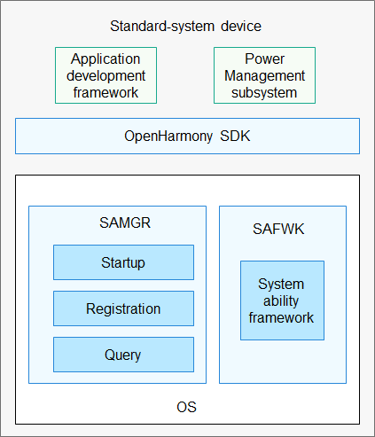

# safwk
## Introduction

The System Ability Framework (safwk) component defines how to implement system abilities in OpenHarmony and provides APIs to start and register system abilities.

## System Architecture

**Figure 1** Architecture of safwk




## Directory Structure

```
/foundation/systemabilitymgr
│── safwk                # Directory of safwk
│  ├── bundle.json      # Description and build file of safwk
│  ├── etc              # Configuration files
│  ├── interfaces       # APIs exposed externally
│  ├── services         # Service implementation
│  ├── test             # Test cases
```

## Usage

### Available APIs

| API                                                      | Description                              |
| ------------------------------------------------------------ | -------------------------------------- |
| sptr\<IRemoteObject> GetSystemAbility(int32_t systemAbilityId); | Obtains the remote procedure call (RPC) object of a system ability.           |
| bool Publish(sptr\<IRemoteObject> systemAbility);            | Publishes a system ability.                        |
| virtual void DoStartSAProcess(const std::string& profilePath) = 0; | Enables a system ability based on its profile.|

### How to Use

A system ability is implemented by using a XXX.cfg, a profile.json, and a libXXX.z.so. The init process starts the SystemAbility process by executing the corresponding XXX.cfg file.

**Implementing a System Ability in C++**

The sample code is as follows:

**1. Define the *IXXX* class for IPC.**

The *IXXX* class is used to define the functions for the system ability to provide specific capabilities. To define this class, inherit from the **IRemoteBroker** class provided by OpenHarmony for Inter-Process Communication (IPC) and implement the **DECLARE\_INTERFACE\_DESCRIPTOR\(*XXX*)** that uniquely identifies this class. The identifier is used for IPC verification.

```
namespace OHOS {
class IListenAbility : public IRemoteBroker {
public:
    virtual int AddVolume(int volume) = 0;

public:
    enum {
        ADD_VOLUME = 1,
    };
public:
    DECLARE_INTERFACE_DESCRIPTOR(u"OHOS.test.IListenAbility");
};
}
```

**2. Define the *XXX*Proxy class for client communication.**

```
namespace OHOS {
class ListenAbilityProxy : public IRemoteProxy<IListenAbility> {
public:
    int AddVolume(int volume);

    explicit ListenAbilityProxy(const sptr<IRemoteObject>& impl)
        : IRemoteProxy<IListenAbility>(impl)
    {
    }

private:
    static inline BrokerDelegator<ListenAbilityProxy> delegator_;
};
} // namespace OHOS
```

**3. Define the *XXX*Stub class for server communication.**

```
namespace OHOS {
int32_t ListenAbilityStub::OnRemoteRequest(uint32_t code,
    MessageParcel& data, MessageParcel &reply, MessageOption &option)
{
    switch (code) {
        case ADD_VOLUME: {
            return reply.WriteInt32(AddVolume(data.ReadInt32()));
        }

        default:
            return IPCObjectStub::OnRemoteRequest(code, data, reply, option);
    }
}
}
```

**4. Implement a system ability.**

```
namespace {
constexpr OHOS::HiviewDFX::HiLogLabel LABEL = {LOG_CORE, 0xD001800, "SA_TST"};
}

REGISTER_SYSTEM_ABILITY_BY_ID(ListenAbility, DISTRIBUTED_SCHED_TEST_LISTEN_ID, true);

ListenAbility::ListenAbility(int32_t saId, bool runOnCreate) : SystemAbility(saId, runOnCreate)
{
    HiLog::Info(LABEL, ":%s called", __func__);
    HiLog::Info(LABEL, "ListenAbility()");
}

ListenAbility::~ListenAbility()
{
    HiLog::Info(LABEL, "~ListenAbility()");
}

int ListenAbility::AddVolume(int volume)
{
    pid_t current = getpid();
    HiLog::Info(LABEL, "ListenAbility::AddVolume volume = %d, pid = %d.", volume, current);
    return (volume + 1);
}

void ListenAbility::OnDump()
{
}

void ListenAbility::OnStart()
{
    HiLog::Info(LABEL, "ListenAbility::OnStart()");
    HiLog::Info(LABEL, "ListenAbility:%s called:-----Publish------", __func__);
    bool res = Publish(this);
    if (res) {
        HiLog::Error(LABEL, "ListenAbility: res == false");
    }
    HiLog::Info(LABEL, "ListenAbility:%s called:AddAbilityListener_OS_TST----beg-----", __func__);
    AddSystemAbilityListener(DISTRIBUTED_SCHED_TEST_OS_ID);
    HiLog::Info(LABEL, "ListenAbility:%s called:AddAbilityListener_OS_TST----end-----", __func__);

    HiLog::Info(LABEL, "ListenAbility:%s called:StopAbility_OS_TST----beg-----", __func__);
    StopAbility(DISTRIBUTED_SCHED_TEST_OS_ID);
    HiLog::Info(LABEL, "ListenAbility:%s called:StopAbility_OS_TST----end-----", __func__);
    return;
}

void ListenAbility::OnStop()
{
}
```

**5. Configure the system ability.**

Configure the profile of the system ability so that the system ability can be loaded and registered. The configuration procedure is as follows:

Create a folder named **sa_profile** in the root directory of the subsystem. Then, create two files in this folder, including an json file prefixed with the service ID of the system ability and a **BUILD.gn** file.

Sample *serviceid*.json file:

```
{
    "process": "listen_test",
    "systemability": [
        {
            "name": 1494,
            "libpath": "liblisten_test.z.so",
            "run-on-create": true,
            "distributed": true,
            "dump_level": 1
        }
    ]
}
```

Sample **BUILD.gn** file:

```
import("//build/ohos/sa_profile/sa_profile.gni")
ohos_sa_profile("xxx_sa_profile") {
    sources = [
        "serviceid.json"
    ]
    subsystem_name = "systemabilitymgr"
}
```

>**NOTE**
>1.  Set **process** to the name of the process where the system ability will run. This parameter is mandatory.
>2.  The *serviceid*.json file can contain only one **systemability** node. Multiple **systemability** nodes will cause a build failure.
>3.  Set **name** to the service ID registered in the code for the system ability. This parameter is mandatory.
>4.  Set **libpath** to the path for loading the system ability. This parameter is mandatory.
>5.  Set **run-on-create** to **true** if you want to register this system ability with the Samgr component immediately after the process is started. Set it to **false** if you want the system ability to start only when it is accessed. This parameter is mandatory.
>6.  Set **distributed** to **true** if this system ability allows cross-device access. Set it to **false** if it allows IPC only on the local device.
>7.  **bootphase** specifies the startup priority of the system ability. The value can be **BootStartPhase** (highest), **CoreStartPhase**, or **OtherStartPhase** (lowest). In the same process, system abilities of a lower priority can be started and registered only after those of a higher priority have all been started and registered. This parameter is optional. The default value is **OtherStartPhase**.
>8.  **dump-level** specifies the level supported by the system dumper. The default value is **1**.
>9. In the **BUILD.gn** file, set **subsystem_name** to the subsystem name, and add the list of system abilities to be configured for the subsystem in **sources**. Multiple system abilities can be configured.

After the preceding steps are complete, an json file named by the process will be generated in the **out**, for example, **out\...\system\profile\listen_test.json**.

**6. Configure the .cfg file.**

The .cfg file contains the native process startup policy provided by Linux. During the system startup process, the init process parses the .cfg file to start the native process.

```
{
    "jobs" : [{
            "name" : "post-fs-data",
            "cmds" : [
                "start listen_test"
            ]
        }
    ],
	"services" : [{
            "name" : "listen_test",
            "path" : ["/system/bin/sa_main", "/system/profile/listen_test.json"],
            "uid" : "system",
            "gid" : ["system", "shell"]
        }
    ]
}
```

>**NOTE**
>
>For details about the implementation of listen_ability, see **test/services/safwk/unittest/common/listen_ability**.

## Repositories Involved

Samgr

[**systemabilitymgr\_safwk**](https://gitee.com/openharmony/systemabilitymgr_safwk)

[systemabilitymgr\_samgr](https://gitee.com/openharmony/systemabilitymgr_samgr)

[systemabilitymgr\_safwk\_lite](https://gitee.com/openharmony/systemabilitymgr_safwk_lite)

[systemabilitymgr\_samgr\_lite](https://gitee.com/openharmony/systemabilitymgr_samgr_lite)
